# Architecture · Returns Manager (RTN)

> **Cube Buildathon · 04 · Round 2 · Individual Build**

---

## Table of Contents

1. [System Overview](#1-system-overview)
2. [Component Architecture](#2-component-architecture)
3. [Data Flow](#3-data-flow)
4. [Agent / Tool Architecture](#4-agent--tool-architecture)
5. [API Design](#5-api-design)
6. [Data Models](#6-data-models)
7. [Evidence Model](#7-evidence-model)
8. [Identity Pipeline](#8-identity-pipeline)
9. [Completeness Pipeline](#9-completeness-pipeline)
10. [Condition Pipeline](#10-condition-pipeline)
11. [Disposition / Rules Engine](#11-disposition--rules-engine)
12. [Uncertainty Handling](#12-uncertainty-handling)
13. [Tenant Isolation](#13-tenant-isolation)
14. [Security](#14-security)
15. [Testing Strategy](#15-testing-strategy)
16. [Deployment Architecture](#16-deployment-architecture)
17. [Technology Choices and Reasons](#17-technology-choices-and-reasons)
18. [Implementation Phases](#18-implementation-phases)

---

## 1. System Overview

The Returns Manager is **Step 4 of 5** in the Cube Buildathon operational chain. It receives a returned product and answers four questions:

1. **Identity** — Is this the item that was sold?
2. **Completeness** — Are all expected parts present?
3. **Condition** — What condition is it in (Amazon's published scale)?
4. **Disposition** — What should happen to it next?

Every answer is backed by structured evidence so that a downstream Recovery Manager (Step 5) can consume the output.

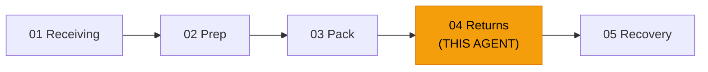

### Design Principles

| Principle | Source | Implementation |
|---|---|---|
| UNCERTAIN is first-class | RULES.md §2.4 | Three-value verdicts everywhere |
| Fail open | RULES.md §2.3 | Errors → `pending_review`, never discard |
| Batch model calls | RULES.md §2.2 | Single batched vision call per assessment |
| Authoritative rules only | RULES.md §2.5 | Amazon condition scale looked up, not invented |
| Overrides are data | RULES.md §3.3 | Original + revised + reason preserved |
| Tenancy isolation | RULES.md §2.1 | org_id scoping on every query and record |
| Deterministic disposition | README.md | Rules engine with explicit threshold table |

---

## 2. Component Architecture

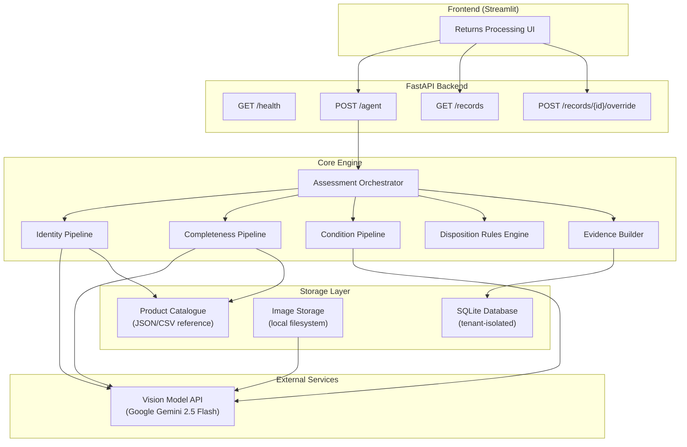

### Component Responsibilities

| Component | Responsibility |
|---|---|
| **FastAPI Backend** | HTTP API, request validation, tenant context injection |
| **Assessment Orchestrator** | Sequences the four checks, collects evidence, handles failures |
| **Identity Pipeline** | Compares returned item against catalogue via vision + metadata |
| **Completeness Pipeline** | Verifies expected parts against photographic evidence |
| **Condition Pipeline** | Classifies condition on Amazon's published scale |
| **Disposition Rules Engine** | Deterministic rules mapping (identity, completeness, condition) → disposition |
| **Evidence Builder** | Assembles the official evidence contract JSON |
| **SQLite Database** | Persists evidence records with tenant isolation |
| **Image Storage** | Tenant-scoped filesystem directories for uploaded images |
| **Product Catalogue** | Reference data for SKU/ASIN → expected parts, product details |

---

## 3. Data Flow

### Primary Assessment Flow

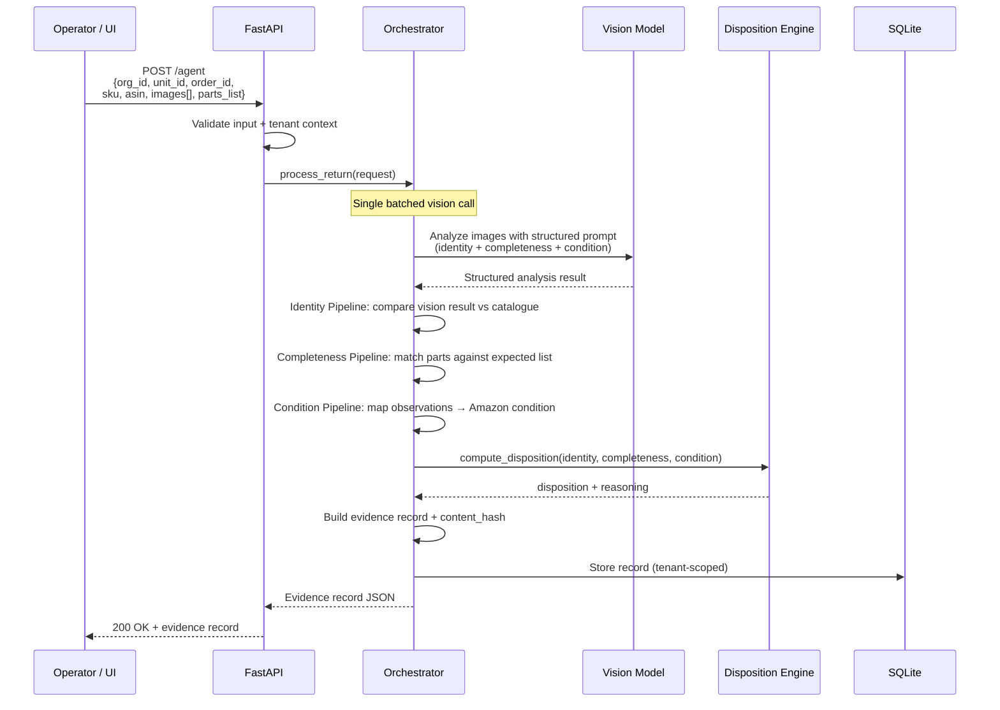

### Override Flow

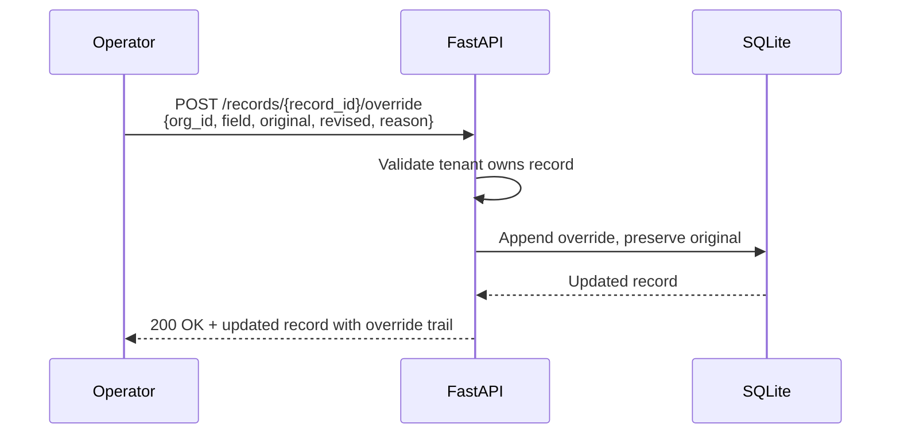

### Error / Fail-Open Flow

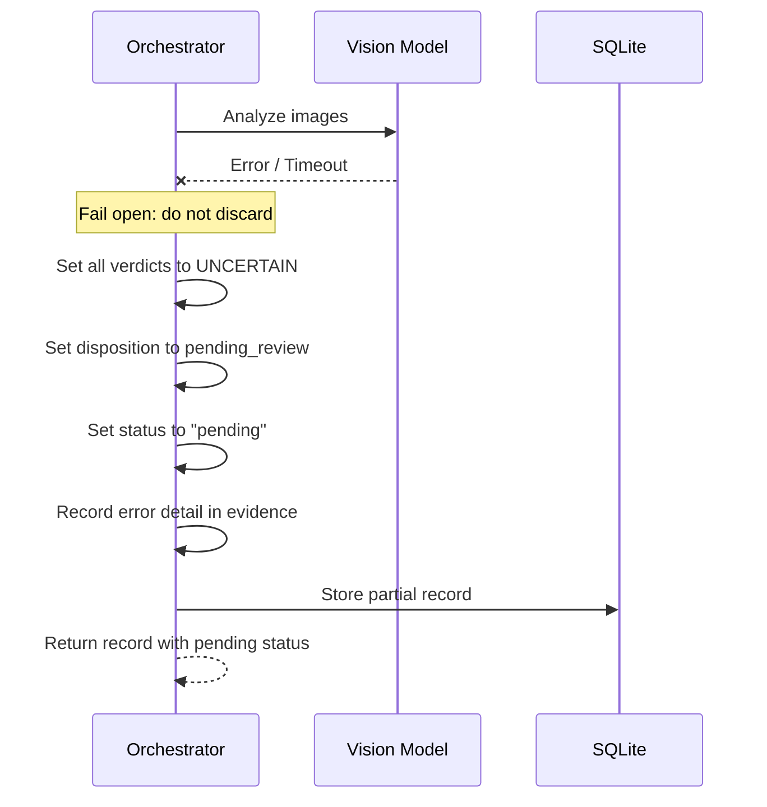

---

## 4. Agent / Tool Architecture

### Single Agent Design

One Returns Manager agent with clearly defined tool functions. No unnecessary multi-agent complexity.

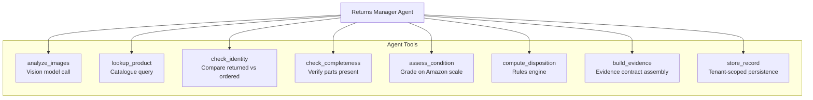

### Tool Descriptions

| Tool | Input | Output | Notes |
|---|---|---|---|
| `analyze_images` | image bytes[], structured prompt | Visual observations JSON | **Single batched call** covering identity, completeness, condition observations |
| `lookup_product` | sku or asin | Product metadata (name, expected parts, reference images) | Queries local catalogue |
| `check_identity` | visual observations, catalogue data | verdict (PASS/FAIL/UNCERTAIN), confidence, detail | Deterministic comparison with vision-aided support |
| `check_completeness` | visual observations, expected parts list | per-part status (PRESENT/MISSING/NOT_OBSERVED), overall verdict | Does not claim MISSING solely from one photo |
| `assess_condition` | visual observations | observed_state, amazon_condition grade, confidence | Uses Amazon's published scale |
| `compute_disposition` | identity result, completeness result, condition result | disposition + rule trace | Pure deterministic rules, no LLM |
| `build_evidence` | all check results | Complete evidence record JSON | Generates record_id, content_hash, timestamps |
| `store_record` | evidence record, org_id | stored record | Tenant-scoped write |

### Batched Vision Call Strategy

Per RULES.md §2.2, we avoid making separate model calls for each check. Instead, a **single vision model call** receives all images and a structured prompt requesting:

```text
1. Product identification observations (brand, model, markings, physical design)
2. Parts/components visible in the images
3. Physical condition observations (packaging state, wear, damage, functionality clues)
```

The model returns structured JSON observations. The deterministic pipelines then consume these observations to produce verdicts.

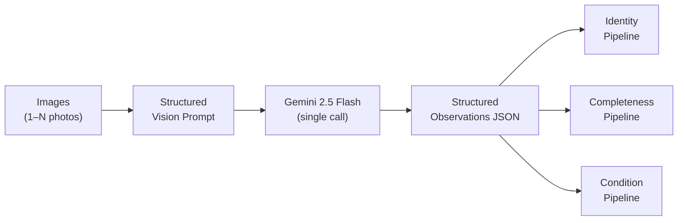

---

## 5. API Design

### `GET /health`

Health check endpoint.

**Response `200 OK`:**
```json
{
  "status": "healthy",
  "service": "returns-manager",
  "version": "1.0.0",
  "timestamp": "2026-09-27T10:00:00Z"
}
```

### `POST /agent`

Main returns assessment endpoint.

**Request body:**
```json
{
  "organization_id": "org_demo_alpha",
  "client_id": "client_001",
  "unit_id": "UNIT-0003",
  "order_id": "ORD-DUMMY-50003",
  "ordered_sku": "SKU-PUZZLE-500",
  "ordered_asin": "B0DUMMY729",
  "parts_list": ["puzzle pieces", "poster"],
  "operator_id": "op_chen",
  "images": [
    { "filename": "UNIT-0003_1.jpg", "data": "<base64>" },
    { "filename": "UNIT-0003_2.jpg", "data": "<base64>" }
  ]
}
```

> Images may also be provided as URLs or multipart file uploads. The API accepts both `application/json` with base64 and `multipart/form-data`.

**Response `200 OK`:** Full evidence record (see §7).

**Error responses:**

| Code | Condition |
|---|---|
| `400` | Missing required fields, invalid image format, invalid org_id |
| `401` | Missing or invalid API key |
| `422` | Validation error (e.g., images too large, unsupported format) |
| `500` | Internal error (record still stored as `pending_review`) |

### `GET /records/{record_id}`

Retrieve a stored evidence record.

**Query parameters:** `organization_id` (required — enforces tenant isolation).

### `GET /records`

List evidence records for a tenant.

**Query parameters:** `organization_id` (required), `unit_id` (optional filter), `status` (optional filter).

### `POST /records/{record_id}/override`

Submit an operator override for a check or disposition.

**Request body:**
```json
{
  "organization_id": "org_demo_alpha",
  "operator_id": "op_chen",
  "field": "disposition",
  "original_value": "liquidate",
  "revised_value": "refurbish",
  "reason": "Item is structurally intact, only cosmetic scuffing"
}
```

---

## 6. Data Models

### Product Catalogue Entry

```json
{
  "sku": "SKU-PUZZLE-500",
  "asin": "B0DUMMY729",
  "product_name": "500-Piece Jigsaw Puzzle",
  "brand": "DummyBrand",
  "category": "Toys & Games",
  "expected_parts": ["puzzle pieces", "poster"],
  "reference_identifiers": {
    "model_number": "PZL-500",
    "upc": "000000000000"
  },
  "weight_g": 450,
  "description": "500-piece jigsaw puzzle with reference poster"
}
```

### Return Assessment Request (internal)

```python
@dataclass
class ReturnRequest:
    organization_id: str          # Tenant
    client_id: str                # Client within tenant
    unit_id: str                  # Cross-chain join key
    order_id: str                 # Original order
    ordered_sku: str              # What was sold
    ordered_asin: str             # ASIN of sold item
    parts_list: list[str]         # Expected components
    operator_id: str              # Operator handling the return
    images: list[ImageInput]      # Uploaded photos
```

### Image Input

```python
@dataclass
class ImageInput:
    filename: str
    content_type: str             # image/jpeg, image/png
    data: bytes                   # Raw image bytes
    size_bytes: int
```

### Vision Observations (model output)

```python
@dataclass
class VisionObservations:
    product_observations: ProductObservations
    parts_observations: list[PartObservation]
    condition_observations: ConditionObservations
    image_quality: ImageQuality
    raw_model_response: str       # Preserved for traceability
    model_version: str
    latency_ms: int
```

---

## 7. Evidence Model

The evidence record follows the **official Buildathon evidence contract** specified in README.md and RULES.md §3.2.

### Evidence Record (full schema)

```json
{
  "record_id": "RTN-20260927-A1B2C3",
  "schema_version": "1.0.0",
  "organization_id": "org_demo_alpha",
  "client_id": "client_001",
  "agent": "returns-manager@1.0.0",
  "subject": {
    "unit_id": "UNIT-0003",
    "order_id": "ORD-DUMMY-50003",
    "ordered_sku": "SKU-PUZZLE-500",
    "ordered_asin": "B0DUMMY729"
  },
  "captured_at": "2026-09-27T10:15:30Z",
  "operator_label": "op_chen",
  "images": [
    {
      "image_id": "img_001",
      "filename": "UNIT-0003_1.jpg",
      "storage_path": "org_demo_alpha/UNIT-0003/img_001.jpg",
      "content_type": "image/jpeg",
      "size_bytes": 245000,
      "hash_sha256": "a1b2c3..."
    }
  ],
  "checks": [
    {
      "check_key": "identity",
      "verdict": "PASS",
      "confidence": 0.92,
      "detail": "Product matches ordered SKU-PUZZLE-500. Observed brand 'DummyBrand', box art matches catalogue reference. 500-piece count visible on packaging.",
      "evidence": [
        {
          "evidence_id": "ev_001",
          "claim": "Returned product matches ordered SKU",
          "evidence_type": "visual_match",
          "source": "img_001",
          "observation": "Brand name 'DummyBrand' visible on box, '500 pieces' label matches catalogue",
          "confidence": 0.92
        }
      ],
      "model_version": "gemini-2.5-flash",
      "latency_ms": 1850
    },
    {
      "check_key": "completeness",
      "verdict": "PASS",
      "confidence": 0.85,
      "detail": "All expected parts observed: puzzle pieces (bag visible), poster (visible in box).",
      "parts_status": [
        { "part": "puzzle pieces", "status": "PRESENT", "confidence": 0.90 },
        { "part": "poster", "status": "PRESENT", "confidence": 0.80 }
      ],
      "evidence": [
        {
          "evidence_id": "ev_002",
          "claim": "Puzzle pieces present",
          "evidence_type": "visual_observation",
          "source": "img_002",
          "observation": "Sealed bag of puzzle pieces visible inside open box",
          "confidence": 0.90
        }
      ],
      "model_version": "gemini-2.5-flash",
      "latency_ms": 0
    },
    {
      "check_key": "condition",
      "verdict": "PASS",
      "confidence": 0.80,
      "detail": "Item appears opened but unused. Box shows minor shelf wear. Contents appear intact.",
      "observed_state": "opened_unused",
      "amazon_condition": "Like New",
      "evidence": [
        {
          "evidence_id": "ev_003",
          "claim": "Product is opened but unused",
          "evidence_type": "visual_assessment",
          "source": "img_001, img_003",
          "observation": "Box opened, seal broken, but puzzle bags are sealed and poster is unfolded",
          "confidence": 0.80
        }
      ],
      "model_version": "gemini-2.5-flash",
      "latency_ms": 0
    }
  ],
  "outcome": {
    "disposition": "restock",
    "amazon_condition": "Like New",
    "rule_trace": "identity=PASS ∧ completeness=PASS ∧ condition≥LikeNew → restock",
    "confidence": 0.80
  },
  "overrides": [],
  "status": "completed",
  "content_hash": "sha256:e3b0c44298fc..."
}
```

### Check Verdict Enum

| Verdict | Meaning | When to use |
|---|---|---|
| `PASS` | Evidence supports the condition | Clear positive evidence |
| `FAIL` | Evidence supports that the condition is NOT met | Clear negative evidence |
| `UNCERTAIN` | Evidence is insufficient for reliable judgment | Ambiguous, poor images, contradictory signals |

### Override Structure

```json
{
  "override_id": "ovr_001",
  "timestamp": "2026-09-27T10:20:00Z",
  "operator_id": "op_chen",
  "field": "disposition",
  "original_value": "liquidate",
  "revised_value": "refurbish",
  "reason": "Item is structurally intact, only cosmetic scuffing on outer box",
  "check_key": null
}
```

> [!IMPORTANT]
> Per RULES.md §3.3: overrides **never** silently replace the original. Both the original verdict and the revised verdict are preserved with the reason for the change.

### Content Hash

`content_hash` is a SHA-256 digest computed over the canonical JSON of the evidence record (excluding the `content_hash` field itself and `overrides`). This provides tamper-detection but we do **not** claim immutability or independent verifiability unless those features are actually demonstrated (per RULES.md §6.1).

---

## 8. Identity Pipeline

### Purpose

Determine whether the returned product matches the item from the original order.

### Logic

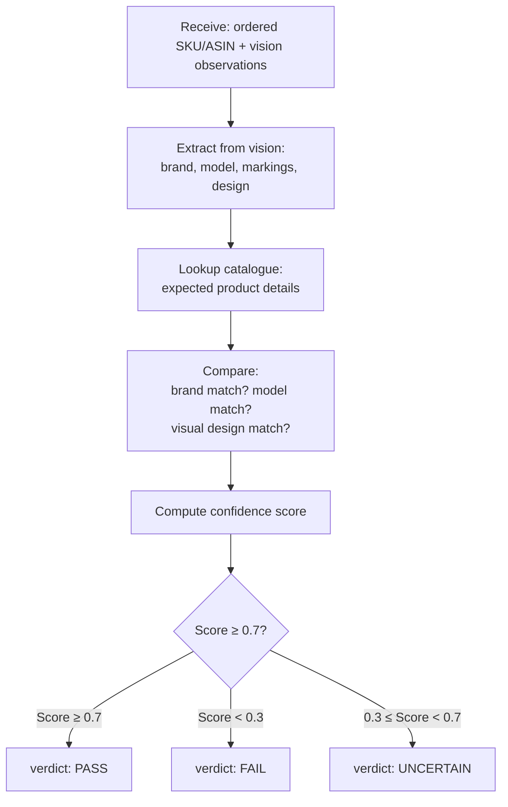

### Matching Criteria

| Signal | Weight | Source |
|---|---|---|
| Brand name visible and matches | High | Vision observation |
| Model/SKU visible on product or packaging | High | Vision observation |
| Physical design matches catalogue description | Medium | Vision observation vs catalogue |
| Packaging/labelling consistent | Medium | Vision observation |
| ASIN barcode readable and matches | High (if available) | Vision observation |

### Identity Verdict Rules

| Condition | Verdict | Confidence Range |
|---|---|---|
| Multiple strong matches (brand + model + design) | PASS | 0.80–1.00 |
| Single strong match, others consistent | PASS | 0.70–0.85 |
| No clear match signals, but no contradictions | UNCERTAIN | 0.30–0.60 |
| Contradictory signals (wrong brand, wrong design) | FAIL | 0.05–0.30 |
| Poor image quality, nothing readable | UNCERTAIN | 0.10–0.40 |

> **Key constraint:** If the evidence is insufficient, the verdict must be `UNCERTAIN`, not a forced PASS or FAIL.

---

## 9. Completeness Pipeline

### Purpose

Verify that all expected parts and accessories are present.

### Logic

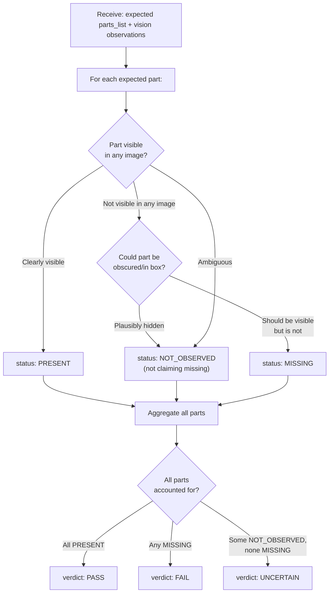

### Part Status Enum

| Status | Meaning |
|---|---|
| `PRESENT` | Part clearly observed in at least one image |
| `MISSING` | Part is expected, images show its expected location, and it is absent |
| `NOT_OBSERVED` | Part not seen in provided images, but could be hidden / inside packaging |

> **Key constraint:** Per the requirements, we must **not** claim an item is MISSING merely because it is not visible in one photograph. `NOT_OBSERVED` is the appropriate status when evidence is inconclusive.

### Overall Completeness Verdict

| Parts Status | Verdict |
|---|---|
| All parts are PRESENT | PASS |
| One or more parts are MISSING | FAIL |
| No parts are MISSING but some are NOT_OBSERVED | UNCERTAIN |

---

## 10. Condition Pipeline

### Purpose

Classify the returned item's condition using **Amazon's published condition grading scale**. The `amazon_condition` column in the sample data is deliberately empty — we must fill it.

> [!IMPORTANT]
> Per RULES.md §2.5 and §4: we must use the **authoritative published condition scale**, not an invented one. Per data/README.md: `observed_state` is an **observation**, not a condition grade.

### Amazon Condition Grades (authoritative source)

The following condition grades are from Amazon's Seller Central condition guidelines for items sold on Amazon:

| Condition Grade | Description |
|---|---|
| **New** | Factory sealed, original packaging intact, never opened |
| **Like New** | Opened but item is in perfect, unused condition with all original packaging and accessories |
| **Very Good** | Item shows minor signs of wear but functions perfectly, minor cosmetic imperfections |
| **Good** | Item shows signs of use, may have cosmetic damage, but functions properly |
| **Acceptable** | Item shows significant wear, noticeable cosmetic damage, but still functional |
| **Unacceptable / Unsellable** | Item is damaged, incomplete, or non-functional to the extent it cannot be resold |

### Two-Stage Assessment

We separate **observation** from **classification** to maintain traceability:

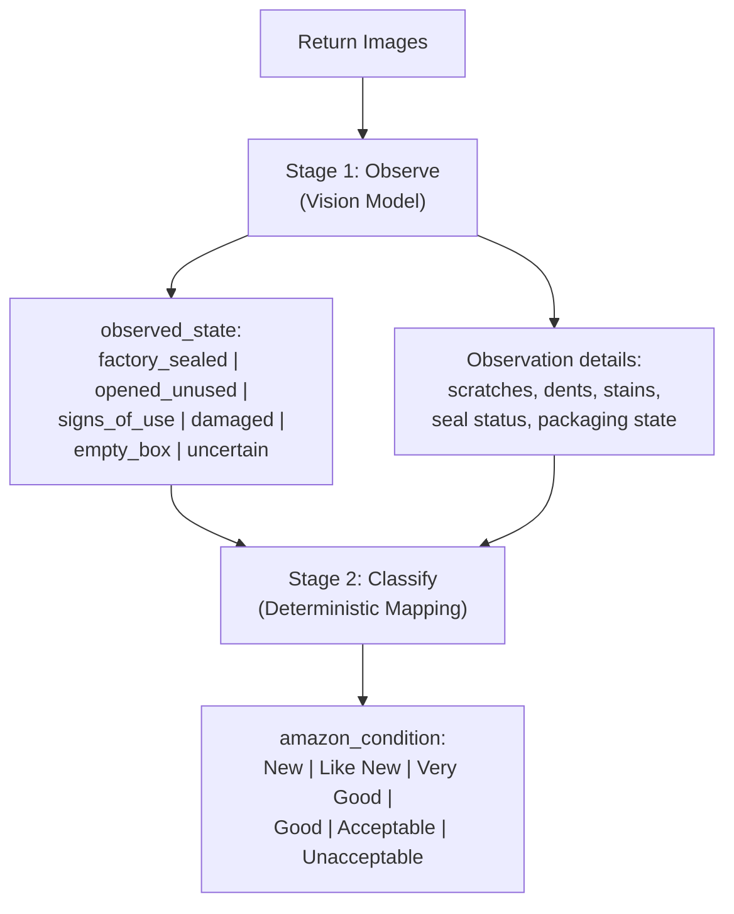

### Observation → Condition Mapping Rules

| Observed State | Observation Details | Amazon Condition |
|---|---|---|
| `factory_sealed` | Seal intact, no damage | **New** |
| `factory_sealed` | Seal intact, minor box damage | **New** (item inside is sealed) |
| `opened_unused` | No wear, all intact | **Like New** |
| `opened_unused` | Minor box wear, item perfect | **Like New** |
| `signs_of_use` | Minor cosmetic only, functional | **Very Good** or **Good** |
| `signs_of_use` | Moderate wear, still functional | **Good** or **Acceptable** |
| `damaged` | Cosmetic damage, functional | **Acceptable** |
| `damaged` | Structural damage, functionality unknown | **Unacceptable** |
| `empty_box` | No product inside | **Unacceptable** |
| `uncertain` | Cannot determine | **UNCERTAIN** (→ pending_review) |

> **Key constraint:** We **never** claim functionality from photographs alone unless the evidence explicitly establishes functionality. For electronics or items requiring power-on testing, condition grades that imply functionality should note that functional testing was not performed.

### Condition Confidence

- `factory_sealed` with clear seal → high confidence (0.85–0.95)
- `opened_unused` with clear images → moderate-high confidence (0.70–0.85)
- `signs_of_use` → moderate confidence (0.50–0.75), varies with clarity
- `damaged` → moderate confidence (0.60–0.80)
- Any observation from poor-quality images → reduced confidence, may trigger UNCERTAIN

---

## 11. Disposition / Rules Engine

### Purpose

Determine what should happen to the returned item. This decision must be **deterministic and explainable** — the LLM does not arbitrarily choose a disposition.

### Disposition Values

| Disposition | Meaning |
|---|---|
| `restock` | Item can be returned to sellable inventory |
| `refurbish` | Item needs minor work before resale |
| `liquidate` | Item cannot be restocked but has residual value |
| `dispose` | Item has no residual value, should be discarded |
| `pending_review` | Insufficient evidence for automated decision; requires human review |

### Rules Engine

The disposition is computed from the three check results using an explicit decision table:

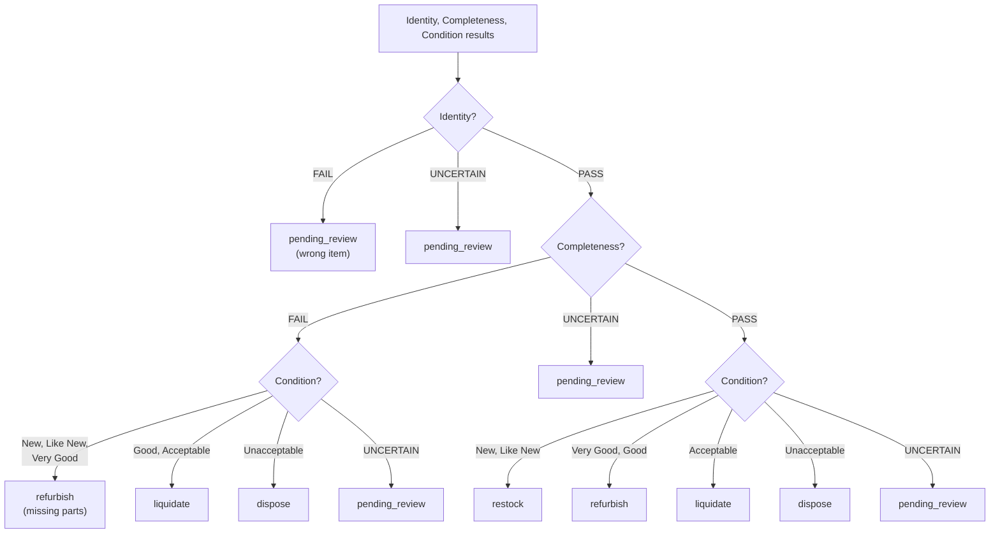

### Disposition Decision Table

| Identity | Completeness | Condition | Disposition | Rule ID |
|---|---|---|---|---|
| FAIL | any | any | pending_review | R01 |
| UNCERTAIN | any | any | pending_review | R02 |
| PASS | UNCERTAIN | any | pending_review | R03 |
| PASS | PASS | New | restock | R04 |
| PASS | PASS | Like New | restock | R05 |
| PASS | PASS | Very Good | refurbish | R06 |
| PASS | PASS | Good | refurbish | R07 |
| PASS | PASS | Acceptable | liquidate | R08 |
| PASS | PASS | Unacceptable | dispose | R09 |
| PASS | PASS | UNCERTAIN | pending_review | R10 |
| PASS | FAIL | New/Like New/Very Good | refurbish | R11 |
| PASS | FAIL | Good/Acceptable | liquidate | R12 |
| PASS | FAIL | Unacceptable | dispose | R13 |
| PASS | FAIL | UNCERTAIN | pending_review | R14 |

Every disposition decision includes the `rule_trace` field showing which rule was applied and why.

---

## 12. Uncertainty Handling

Per RULES.md §2.4, `UNCERTAIN` is a **first-class verdict**, not a low-confidence PASS.

### Sources of Uncertainty

| Source | Handling |
|---|---|
| **Poor image quality** | Reduce confidence, may trigger UNCERTAIN verdict |
| **Ambiguous visual evidence** | UNCERTAIN verdict, flag for human review |
| **Contradictory signals** | Document the contradiction, UNCERTAIN verdict |
| **Model failure / timeout** | Fail open: preserve data, status=pending, all verdicts=UNCERTAIN |
| **Missing images** | UNCERTAIN for visual checks, note lack of evidence |
| **Part not visible but possibly present** | Part status = NOT_OBSERVED, may trigger UNCERTAIN completeness |

### Confidence Thresholds

| Range | Interpretation |
|---|---|
| 0.80–1.00 | High confidence → automated verdict |
| 0.50–0.79 | Moderate confidence → automated verdict with lower certainty |
| 0.30–0.49 | Low confidence → consider UNCERTAIN |
| 0.00–0.29 | Very low confidence → UNCERTAIN |

### Fail-Open Implementation

```python
# Pseudocode
try:
    observations = await vision_model.analyze(images, prompt)
except (TimeoutError, APIError, ModelError) as e:
    # NEVER discard the input
    return EvidenceRecord(
        checks=[
            Check(check_key="identity", verdict="UNCERTAIN", confidence=0.0,
                  detail=f"Vision model unavailable: {e}"),
            Check(check_key="completeness", verdict="UNCERTAIN", confidence=0.0,
                  detail=f"Vision model unavailable: {e}"),
            Check(check_key="condition", verdict="UNCERTAIN", confidence=0.0,
                  detail=f"Vision model unavailable: {e}"),
        ],
        outcome=Outcome(disposition="pending_review",
                        rule_trace="R_FAILOPEN: model failure → pending_review"),
        status="pending",
    )
```

---

## 13. Tenant Isolation

Per RULES.md §2.1, organisation/client data must be isolated.

### Two Test Tenants

```text
org_demo_alpha
org_demo_bravo
```

### Isolation Strategy

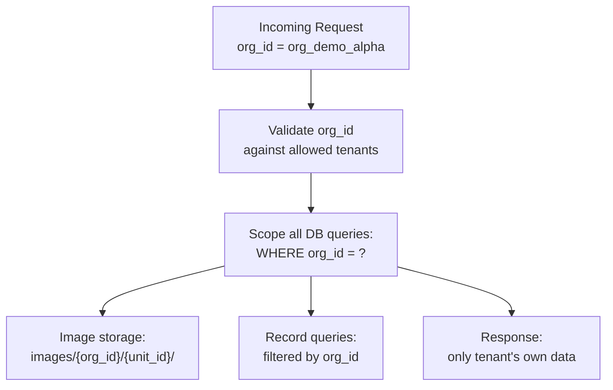

### Implementation Rules

| Layer | Isolation Mechanism |
|---|---|
| **API** | Every request must include `organization_id`; validated before processing |
| **Database** | Every table has `org_id` column; every query filters by `org_id` |
| **Image Storage** | Filesystem paths: `images/{org_id}/{unit_id}/{image_id}.jpg` |
| **Evidence Records** | `organization_id` embedded in every record |
| **API Responses** | Never return data where `org_id` differs from the request's `organization_id` |

### Isolation Tests

1. Create records for `org_demo_alpha`
2. Query records as `org_demo_bravo` → must return zero rows
3. Attempt to access `org_demo_alpha` image by guessing path from `org_demo_bravo` → must fail
4. Attempt to override a record belonging to another org → must fail

---

## 14. Security

### Secret Management

| Item | Approach |
|---|---|
| Vision model API key | Environment variable: `GEMINI_API_KEY` |
| Optional DB credentials | Environment variable |
| `.env` files | Listed in `.gitignore`, never committed |
| `.env.example` | Template with placeholder values, committed |

### Input Validation

| Input | Validation |
|---|---|
| `organization_id` | Must be in allowed set (`org_demo_alpha`, `org_demo_bravo`) |
| `unit_id` | String, matches pattern `UNIT-\d+` |
| `order_id` | String, matches pattern `ORD-.*` |
| Images | Max file size (10 MB per image), max count (10 images), allowed MIME types only (`image/jpeg`, `image/png`, `image/webp`) |
| All string fields | Sanitized, max length enforced |

### API Authentication

- Simple API key authentication via `X-API-Key` header for the backend
- Frontend communicates only with the backend, never directly with the vision model API
- Vision model API key is server-side only

### Image Security

- Uploaded images are validated (file type, size, dimensions)
- Images are stored in tenant-scoped directories
- Image paths are not directly guessable from another tenant's context
- No directory traversal possible in image paths

---

## 15. Testing Strategy

### Test Categories

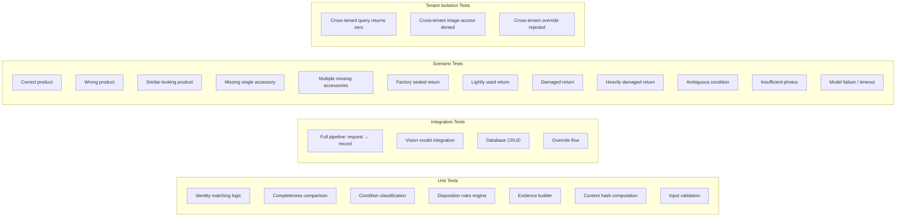

### Scenario Test Matrix

| # | Scenario | Identity | Completeness | Condition | Expected Disposition |
|---|---|---|---|---|---|
| 1 | Correct product, complete, sealed | PASS | PASS | New | restock |
| 2 | Correct product, complete, opened unused | PASS | PASS | Like New | restock |
| 3 | Correct product, complete, light use | PASS | PASS | Very Good | refurbish |
| 4 | Correct product, complete, damaged | PASS | PASS | Acceptable | liquidate |
| 5 | Correct product, complete, heavily damaged | PASS | PASS | Unacceptable | dispose |
| 6 | Correct product, missing 1 part, good | PASS | FAIL | Good | liquidate |
| 7 | Correct product, missing 2+ parts, like new | PASS | FAIL | Like New | refurbish |
| 8 | Wrong product entirely | FAIL | — | — | pending_review |
| 9 | Similar-looking product (ambiguous) | UNCERTAIN | — | — | pending_review |
| 10 | Empty box | PASS/UNCERTAIN | FAIL | Unacceptable | dispose |
| 11 | Blurry / insufficient photos | UNCERTAIN | UNCERTAIN | UNCERTAIN | pending_review |
| 12 | Model API failure | UNCERTAIN | UNCERTAIN | UNCERTAIN | pending_review |

### Evaluation Requirements (from RULES.md §5)

- **50+ unseen units** with two independent human labels
- Report per-check: accuracy, FP, FN, UNCERTAIN rate
- Report important failure modes
- Report latency and cost where relevant
- Use genuinely varied and ambiguous cases

### Test Commands

```bash
# Unit tests
pytest tests/unit/ -v

# Integration tests
pytest tests/integration/ -v

# Scenario tests (may require vision API key)
pytest tests/scenarios/ -v

# Tenant isolation tests
pytest tests/isolation/ -v

# All tests
pytest tests/ -v --tb=short

# With coverage
pytest tests/ --cov=src --cov-report=term-missing
```

---

## 16. Deployment Architecture

### Local Development

```text
┌──────────────────────────────────────┐
│  Developer Machine                   │
│                                      │
│  ┌──────────┐    ┌───────────────┐   │
│  │ Streamlit │───▶│ FastAPI       │   │
│  │ Frontend  │    │ Backend       │   │
│  │ :8501     │    │ :8000         │   │
│  └──────────┘    └───────┬───────┘   │
│                          │           │
│                  ┌───────┴───────┐   │
│                  │ SQLite DB     │   │
│                  │ returns.db    │   │
│                  └───────────────┘   │
│                          │           │
│                  ┌───────┴───────┐   │
│                  │ Image Storage │   │
│                  │ ./images/     │   │
│                  └───────────────┘   │
└──────────────────────────────────────┘
           │
           ▼
   ┌───────────────┐
   │ Gemini API    │
   │ (external)    │
   └───────────────┘
```

### Docker Deployment (optional)

```yaml
# docker-compose.yml (conceptual)
services:
  backend:
    build: .
    ports:
      - "8000:8000"
    environment:
      - GEMINI_API_KEY=${GEMINI_API_KEY}
    volumes:
      - ./data:/app/data
      - ./images:/app/images
      - ./returns.db:/app/returns.db

  frontend:
    build:
      context: .
      dockerfile: Dockerfile.frontend
    ports:
      - "8501:8501"
    environment:
      - API_URL=http://backend:8000
```

### Production Considerations

- SQLite is sufficient for hackathon scope (single-writer, file-based)
- For multi-instance deployment, upgrade to PostgreSQL with `org_id` row-level filtering
- Image storage could move to cloud object storage (S3/GCS) with tenant-prefixed keys
- API key auth is sufficient for demo; production would use JWT/OAuth

---

## 17. Technology Choices and Reasons

| Technology | Choice | Reason |
|---|---|---|
| **Language** | Python 3.11+ | Hackathon-friendly, strong ML/API ecosystem, matches `.gitignore` patterns |
| **API Framework** | FastAPI | Async, automatic OpenAPI docs, Pydantic validation, type-safe |
| **Vision Model** | Google Gemini 2.5 Flash (`gemini-2.5-flash`) | Stable multimodal model (images + text), native structured JSON output, 1M context, cost-effective, fast |
| **Database** | SQLite | Zero config, file-based, sufficient for demo/evaluation, ships with Python |
| **ORM/DB Access** | Raw `sqlite3` or `aiosqlite` | Minimal overhead, full control, no migration framework needed |
| **Frontend** | Streamlit | Rapid prototyping, Python-native, good for image upload and data display |
| **Image Processing** | Pillow (PIL) | Image validation, resizing, format conversion |
| **Testing** | pytest | Standard Python testing, fixtures, parametrize for scenarios |
| **Hashing** | hashlib (stdlib) | SHA-256 for content_hash and image hashing |
| **Validation** | Pydantic v2 | Request/response models, automatic validation, JSON serialization |
| **Config** | python-dotenv | Load `.env` files for local development |

### Why Gemini 2.5 Flash (`gemini-2.5-flash`) over alternatives?

> [!IMPORTANT]
> **Model Lifecycle Note:** Prior generation Flash models have been officially deprecated and shut down by Google as of June 1, 2026 and are not permitted. According to Google's official Gemini API documentation, `gemini-2.5-flash` is the stable production multimodal Flash-class model (with `gemini-3.8-flash` also available as an advanced drop-in option).

**Exact Model Identifier:** `gemini-2.5-flash` (configurable via `GEMINI_MODEL` environment variable, defaulting to `gemini-2.5-flash`).

**Selection Rationale:**
1. **Multi-Image Multimodal Input:** Natively accepts multiple high-resolution photos in a single prompt (package exterior, serial tags, open box, accessory spread), which is essential for comprehensive return parcel inspection.
2. **Native Structured JSON Outputs:** Supports strict schema enforcement (`response_schema` / Pydantic models). The vision model returns guaranteed valid JSON containing product observations, component checklist status, and physical wear details.
3. **Visual Acuity for Identity & Completeness:** Robust recognition of brand typography, model numbers, barcodes, packaging seals, and distinct small parts (cables, manuals, posters, scoops).
4. **Separation of Visual Evidence from Business Rules:** Supplies objective visual observations without forcing condition grades or dispositions, allowing our deterministic rules engine to maintain full control.
5. **Cost, Latency, and Context Capacity:** Features a 1,048,576-token input window and 65,536-token output limit with Flash-tier latency and pricing, ideal for high-throughput returns processing.
6. **SDK Compatibility:** Fully supported by the current `google-genai` Python SDK.

### Dependency List (planned)

```text
fastapi>=0.115.0
uvicorn>=0.30.0
pydantic>=2.0.0
python-dotenv>=1.0.0
google-genai>=1.0.0
Pillow>=10.0.0
aiosqlite>=0.20.0
python-multipart>=0.0.9
streamlit>=1.38.0
pytest>=8.0.0
pytest-asyncio>=0.24.0
httpx>=0.27.0
```

---

## 18. Implementation Phases

### Phase 1: Foundation (Day 1 morning)

**Goal:** Project skeleton, API shell, database, models.

```text
[ ] Project structure (src/, tests/, etc.)
[ ] Pydantic data models (request, response, evidence)
[ ] SQLite schema and tenant-isolated CRUD
[ ] FastAPI app with GET /health
[ ] POST /agent endpoint (returns mock evidence record)
[ ] .env.example with placeholder keys
[ ] requirements.txt
[ ] Basic test harness
```

### Phase 2: Vision Pipeline (Day 1 afternoon)

**Goal:** Image processing and vision model integration.

```text
[ ] Image validation and preprocessing (Pillow)
[ ] Vision model client (Gemini 2.5 Flash - gemini-2.5-flash)
[ ] Structured vision prompt design
[ ] Single batched call for identity + completeness + condition observations
[ ] Parse structured model output into VisionObservations
[ ] Error handling and fail-open logic
[ ] Test with sample images
```

### Phase 3: Core Checks (Day 1 evening / Day 2 morning)

**Goal:** Identity, completeness, condition pipelines.

```text
[ ] Product catalogue (JSON reference data)
[ ] Identity pipeline: vision observations + catalogue → verdict
[ ] Completeness pipeline: parts status → verdict
[ ] Condition pipeline: observations → Amazon condition grade
[ ] Unit tests for each pipeline
[ ] Evidence builder: assemble full evidence record
[ ] Content hash computation
```

### Phase 4: Disposition Engine (Day 2)

**Goal:** Deterministic rules, override support.

```text
[ ] Disposition rules engine (decision table)
[ ] Rule trace in output
[ ] Override endpoint
[ ] Override storage (preserving original + revised + reason)
[ ] Integration tests: full flow request → evidence record
```

### Phase 5: Frontend & UX (Day 2–3)

**Goal:** Operator-facing interface for demo.

```text
[ ] Streamlit app with image upload
[ ] Return assessment form (order details + photos)
[ ] Evidence record display
[ ] Check-by-check detail view
[ ] Override UI
[ ] Records list with tenant filter
```

### Phase 6: Testing & Evaluation (Day 3–4)

**Goal:** Comprehensive testing, evaluation metrics.

```text
[ ] Create test image fixtures (50+ varied scenarios)
[ ] Scenario test suite (12 scenarios from test matrix)
[ ] Tenant isolation test suite
[ ] Evaluation harness: batch run against held-out set
[ ] Compute metrics: accuracy, FP, FN, UNCERTAIN rate per check
[ ] Two-labeller agreement measurement
[ ] Document failure modes
[ ] Performance metrics (latency, cost)
```

### Phase 7: Documentation & Submission (Day 4–5)

**Goal:** Complete all deliverables.

```text
[ ] Update README.md with setup, usage, API docs
[ ] Finalize ARCHITECTURE.md
[ ] Evaluation results report (eval-report.md)
[ ] Demo video recording
[ ] Deploy (if applicable)
[ ] LinkedIn post
[ ] Final submission
```

---

## Appendix A: File Structure (planned)

```text
cube-04-returns-manager/
├── .github/                          # Organizer CI (DO NOT MODIFY)
├── data/
│   ├── README.md                     # Organizer data docs (DO NOT MODIFY)
│   ├── returns_sample.csv            # Organizer sample data (DO NOT MODIFY)
│   └── catalogue.json                # NEW: Product catalogue reference
├── src/
│   ├── __init__.py
│   ├── main.py                       # FastAPI app entry point
│   ├── config.py                     # Settings, env vars
│   ├── models/
│   │   ├── __init__.py
│   │   ├── request.py                # API request models (Pydantic)
│   │   ├── response.py               # API response / evidence models
│   │   └── domain.py                 # Internal domain models
│   ├── api/
│   │   ├── __init__.py
│   │   ├── health.py                 # GET /health
│   │   ├── agent.py                  # POST /agent
│   │   └── records.py                # GET/POST records, overrides
│   ├── core/
│   │   ├── __init__.py
│   │   ├── orchestrator.py           # Assessment orchestrator
│   │   ├── identity.py               # Identity check pipeline
│   │   ├── completeness.py           # Completeness check pipeline
│   │   ├── condition.py              # Condition assessment pipeline
│   │   ├── disposition.py            # Disposition rules engine
│   │   └── evidence.py               # Evidence record builder
│   ├── vision/
│   │   ├── __init__.py
│   │   ├── client.py                 # Vision model client (Gemini)
│   │   ├── prompts.py                # Structured vision prompts
│   │   └── preprocessing.py          # Image validation, resize
│   └── storage/
│       ├── __init__.py
│       ├── database.py               # SQLite setup, migrations
│       ├── records_repo.py           # Evidence record CRUD
│       └── images_repo.py            # Image storage (filesystem)
├── tests/
│   ├── __init__.py
│   ├── conftest.py                   # Shared fixtures
│   ├── unit/
│   │   ├── test_identity.py
│   │   ├── test_completeness.py
│   │   ├── test_condition.py
│   │   ├── test_disposition.py
│   │   ├── test_evidence.py
│   │   └── test_validation.py
│   ├── integration/
│   │   ├── test_api.py
│   │   ├── test_pipeline.py
│   │   └── test_database.py
│   ├── scenarios/
│   │   └── test_scenarios.py         # 12-scenario matrix
│   └── isolation/
│       └── test_tenant_isolation.py
├── frontend/
│   └── app.py                        # Streamlit frontend
├── eval/
│   ├── run_eval.py                   # Evaluation harness
│   └── eval_report.md                # Evaluation results
├── fixtures/                         # Test images
│   └── returns/
├── images/                           # Runtime image storage (gitignored)
├── .env.example                      # Environment variable template
├── .gitignore                        # Organizer gitignore (extended)
├── requirements.txt                  # Python dependencies
├── ARCHITECTURE.md                   # This file
├── GITHUB-GUIDE.md                   # Organizer guide (DO NOT MODIFY)
├── README.md                         # Updated with setup/usage
├── RULES.md                          # Organizer rules (DO NOT MODIFY)
└── submissions/                      # Organizer submissions (DO NOT MODIFY)
```

---

## Appendix B: Database Schema

```sql
CREATE TABLE evidence_records (
    record_id       TEXT PRIMARY KEY,
    schema_version  TEXT NOT NULL DEFAULT '1.0.0',
    org_id          TEXT NOT NULL,
    client_id       TEXT,
    agent           TEXT NOT NULL DEFAULT 'returns-manager@1.0.0',
    unit_id         TEXT NOT NULL,
    order_id        TEXT,
    ordered_sku     TEXT,
    ordered_asin    TEXT,
    operator_id     TEXT,
    captured_at     TEXT NOT NULL,
    status          TEXT NOT NULL DEFAULT 'completed',
    content_hash    TEXT,
    checks_json     TEXT NOT NULL,     -- JSON array of check objects
    outcome_json    TEXT NOT NULL,     -- JSON object: disposition + rule_trace
    images_json     TEXT,              -- JSON array of image metadata
    overrides_json  TEXT DEFAULT '[]', -- JSON array of override objects
    created_at      TEXT NOT NULL DEFAULT (strftime('%Y-%m-%dT%H:%M:%SZ', 'now')),
    updated_at      TEXT NOT NULL DEFAULT (strftime('%Y-%m-%dT%H:%M:%SZ', 'now'))
);

-- Tenant isolation: every query MUST include this filter
CREATE INDEX idx_records_org ON evidence_records(org_id);
CREATE INDEX idx_records_unit ON evidence_records(org_id, unit_id);
CREATE INDEX idx_records_status ON evidence_records(org_id, status);
```

---

## Appendix C: Verification Against Organizer Requirements

| Requirement (source) | Architecture Response |
|---|---|
| Identity check (README.md) | §8 Identity Pipeline |
| Completeness check (README.md) | §9 Completeness Pipeline |
| Condition on Amazon scale (README.md, RULES.md §4, data/README.md) | §10 Condition Pipeline, authoritative scale referenced |
| Disposition (README.md) | §11 Rules Engine with decision table |
| Official evidence contract (RULES.md §3.2) | §7 Evidence Model — all required fields included |
| PASS / FAIL / UNCERTAIN (README.md) | §7, §12 — three-value verdict throughout |
| Overrides are data (RULES.md §3.3) | §7 Override structure, original preserved |
| content_hash (RULES.md §3.2) | §7 SHA-256 content hash |
| Fail open (RULES.md §2.3) | §12 — errors → pending_review, never discard |
| UNCERTAIN first-class (RULES.md §2.4) | §12 — dedicated handling throughout |
| Batch model calls (RULES.md §2.2) | §4 — single batched vision call |
| Authoritative rules (RULES.md §2.5) | §10 — Amazon published condition scale |
| Tenancy isolation (RULES.md §2.1) | §13 — org_id scoped everywhere |
| POST /agent, GET /health (GITHUB-GUIDE.md) | §5 API Design |
| 50+ unseen eval units (RULES.md §5) | §15 Testing Strategy |
| No secrets committed (RULES.md R7) | §14 — .env.example, env vars |
| README.md, ARCHITECTURE.md (README.md) | This document + updated README |
| Cross-manager compatibility (README.md) | §7 — official evidence contract |
| Say what you built (RULES.md §6.1) | content_hash does not claim immutability |
